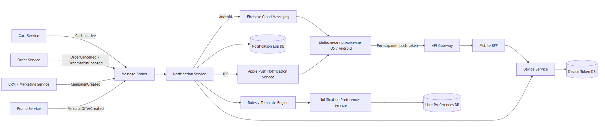

# Задание 3. Верхнеуровневая архитектура PUSH-уведомлений

## Цель
Поддержать PUSH-уведомления: неактивная корзина, отмена и изменение статуса заказа, рекламные рассылки и персональные предложения.

## Архитектурная схема

```

```

## Компоненты

| Компонент | Назначение |
|---|---|
| Mobile App | Получает PUSH, передает токен и обрабатывает deeplink |
| API Gateway | Аутентификация, маршрутизация, rate limiting |
| Mobile BFF | API-слой для мобильного приложения |
| Device Service | Хранение устройств, токенов, платформ и статусов токенов |
| Cart Service | События о неактивной корзине |
| Order Service | События об отмене и изменении статуса заказа |
| CRM / Marketing Service | Массовые и сегментированные кампании |
| Message Broker | Асинхронная передача событий |
| Notification Service | Формирование и отправка PUSH |
| Rules / Template Engine | Выбор шаблона и подстановка данных |
| Preferences Service | Проверка согласий и настроек пользователя |
| FCM / APNS | Внешняя доставка PUSH на Android / iOS |

## Сценарий: отмена заказа

1. `Order Service` публикует событие `OrderCancelled`.
2. Событие поступает в брокер сообщений.
3. `Notification Service` получает событие.
4. Сервис определяет пользователя и его активные устройства.
5. Проверяются настройки уведомлений и согласия пользователя.
6. Формируется сообщение по шаблону.
7. Для Android отправка выполняется через FCM, для iOS — через APNS.
8. Результат отправки сохраняется в журнале.
9. Невалидный токен помечается как неактивный.
10. При нажатии на PUSH приложение открывает deeplink, например `petrushka://orders/{order_id}`.

## Пример события

```json
{
  "event_id": "8d8c9bc9-4a1d-4df4-9c8e-3d3bfcf0d202",
  "event_type": "OrderCancelled",
  "occurred_at": "2026-06-24T10:15:00Z",
  "producer": "order-service",
  "payload": {
    "order_id": "ORD-100045",
    "user_id": "USR-12345",
    "reason": "Товар отсутствует на складе"
  }
}
```

## Пример PUSH

```json
{
  "title": "Заказ отменен",
  "body": "Заказ №ORD-100045 отменен. Причина: товар отсутствует на складе.",
  "data": {
    "type": "order_cancelled",
    "order_id": "ORD-100045",
    "deeplink": "petrushka://orders/ORD-100045"
  }
}
```

## Нефункциональные требования

1. Отправка выполняется асинхронно.
2. Ошибка одного уведомления не блокирует остальные.
3. Временные ошибки обрабатываются повторными попытками с ограничением числа ретраев.
4. Обработка событий идемпотентна: одно событие не создает дублирующие PUSH.
5. Логируются событие, пользователь, тип PUSH, время, статус и ошибка.
6. Для маркетинговых PUSH поддерживается отписка.
7. Учитывается часовой пояс пользователя.
8. Ограничивается частота PUSH одному пользователю.

